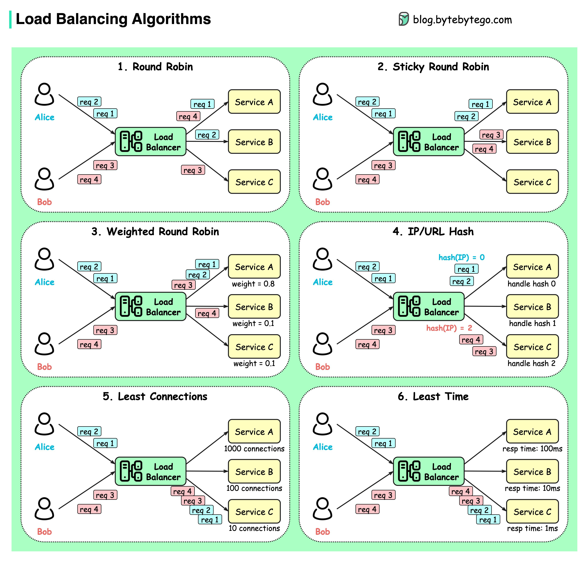

### le rôle de ce service est de répartir les requêtes faites vers le serveur web et de créer un cluster de serveur web non-natif afin d'assurer la continuité de service sur ceux-ci. Ce service est essentiel pour ne pas surcharger les serveurs et assurer une continuité fluide si 1 à un problème.
 
### Justification choix/ on a choisit de faire avec ce service car il est simple à mettre en place et qu'il permet de créer un cluster non natif simplement. on aurait pu également utiliser apache2.


### Exposition réseau et sécurité/ on a besoin d'ouvrir seulement les ports 80 si http et 443 si https et à la limite 22 pour ssh mais que pour notre réseau de vm admin. cette machine se trouve dans la DMZ.


## Installation Nginx 

`sudo apt update`
`sudo apt install nginx`

###  la conf /etc/nginx/sites-available/reverse-proxy.conf

```

upstream backend_pool {
    ip_hash;
    server 192.168.1.156:80;
    server 192.168.1.10:80;
    server 192.168.1.134:80;
}

server {
    listen 80;
    server_name _;

    location / {
        proxy_pass http://backend_pool;

        proxy_http_version 1.1;
        proxy_set_header Host $host;
        proxy_set_header X-Real-IP $remote_addr;
        proxy_set_header X-Forwarded-For $proxy_add_x_forwarded_for;
        proxy_set_header X-Forwarded-Proto $scheme;


        proxy_connect_timeout 5s;
        proxy_send_timeout 30s;
        proxy_read_timeout 30s;
    }
}
```

on renseigne les 3 ips des serveurs web et l'algorithme pour le load balancer ici ip_hash.
il y a plein d'option comme si dessous qui s'adapte à toute les possibilitées.


#### Il ne manque plut qu'à démarrer nginx et tout est bon.

`systemctl restart nginx` 
et aller sur l'ip du loadbalancer : `192.168.1.128:80`