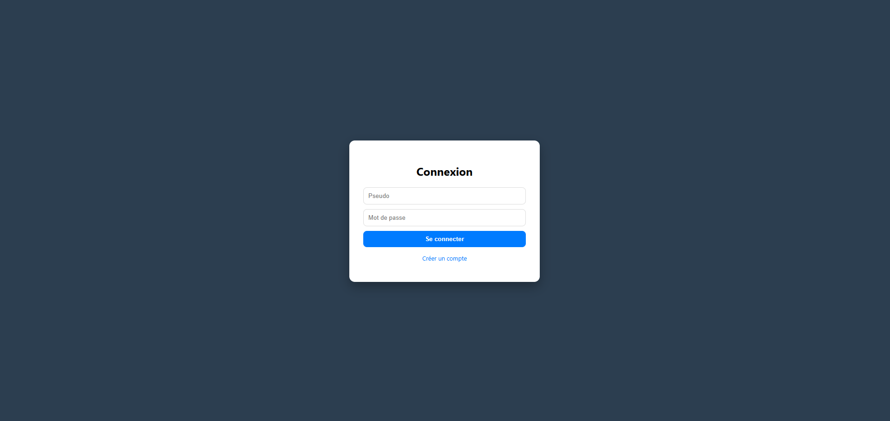
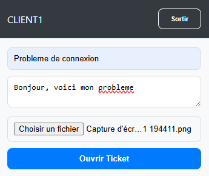
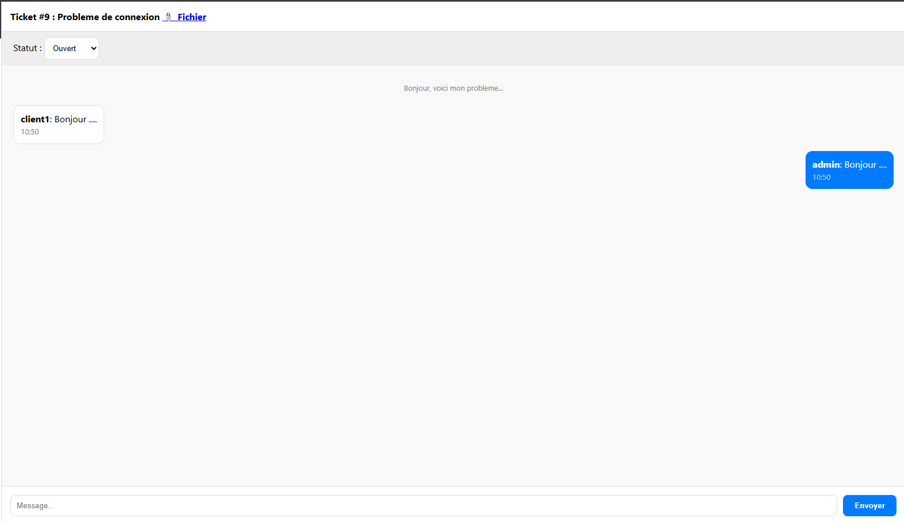

# 🎫 Ticket Chat App - Documentation Technique

Cette application est un système de support client en temps réel permettant aux clients d'ouvrir des tickets avec pièces jointes et aux administrateurs de gérer les demandes via un chat sécurisé.

---

## 📋 Prérequis

- **Node.js** (Version LTS)

- **MariaDB**

- **Terminal** (CMD, PowerShell ou Bash)


---

## 📦 Installation des Dépendances

Installez les dépendances nécessaires au fonctionnement du serveur avec la commande suivante :
```
npm install express mysql2 socket.io multer cookie-parser bcrypt
```
### 📚 Détail des Dépendances

- **express** : Framework web minimaliste pour Node.js. Il gère les routes HTTP, les middlewares et le serveur backend.

- **mysql2** : Client MySQL/MariaDB performant. Il permet la connexion à la base de données, l'exécution de requêtes SQL et la gestion des promesses.

- **socket.io** : Bibliothèque de communication en temps réel. Utilisée pour le chat instantané entre les clients et les administrateurs.

- **multer** : Middleware de gestion des fichiers. Permet l'upload sécurisé de pièces jointes dans les tickets.

- **cookie-parser** : Middleware pour lire et gérer les cookies HTTP. Utilisé pour la gestion des sessions et de l'authentification.

- **bcrypt** : Bibliothèque de hachage cryptographique. Assure la sécurisation des mots de passe stockés en base de données.


---

## 🗄️ Préparation de la Base de Données (CLI)

1. Lance ton outil MariaDB.

2. Exécute le fichier `structure.sql` pour créer la base `ticket_system` et ses tables.

3. Vérifie que la base est bien active.


---

## 📁 Structure du Projet

L'arborescence du projet doit respecter le schéma suivant :

```plaintext  
ticket-chat-app/  
├── public/  
│   ├── index.html  
│   └── uploads/      
├── index.js  
├── structure.sql  
├── package.json  
└── node_modules/  
```
---

## ▶️ Lancement de l'Application

Lancez le serveur avec la commande suivante :
```
node index.js
```
Attendez le message de confirmation :
```
✅ MariaDB Connecté.
```
---

## 👤 Compte Administrateur (Auto-créé)

Lors du premier lancement, le serveur crée automatiquement un compte administrateur :

- **Login** : `admin`

- **Mot de passe** : `admin123`
---  

## 🌐 Accès à l'Application

Ouvrez votre navigateur et accédez à l'adresse suivante :
```  
172.16.10.71
```  

---

## 📸 Captures d’écran

Cette section présente les principales interfaces de l’application afin d’illustrer son fonctionnement.

### 🔐 Connexion / Inscription


Interface permettant aux utilisateurs et administrateurs de s’authentifier ou de créer un compte.

---

### 🎫 Création de Ticket (Client)


Interface client permettant la création d’un nouveau ticket de support.

---

### 💬 Chat du Ticket


Chat en temps réel permettant l’échange de messages entre le client et l’administrateur.

---

### 🛠️ Interface Ticket Administrateur


Vue administrateur permettant la gestion et le traitement des tickets clients.

---

### 🔒 Ticket Fermé

Affichage d’un ticket fermé avec blocage de l’envoi de nouveaux messages.
---  

## 🛡️ Sécurité et Gestion

* **Hachage des mots de passe** : Les mots de passe sont sécurisés avec **bcrypt**.
* **Verrouillage des tickets** : Les tickets au statut **Fermé** bloquent l'envoi de nouveaux messages.
* **Suppression en cascade** : La suppression d'un ticket entraîne automatiquement la suppression de ses messages associés.

---  
  